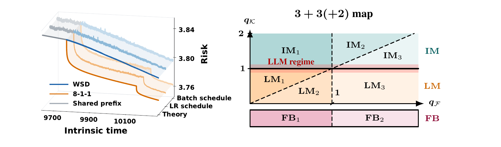

# FROM SPECTRA TO JOINT SCHEDULES IN LLM PRE-TRAINING: 3 + 3(+2) SCALING-LAW REGIMES



*A forcing--memory surrogate fits 124M nanoGPT loss across schedules and situates its effective source--capacity condition in the 3+3(+2) propagation map.*

## Abstract

Power-law learning curves are often treated as fixed properties of a model and its data, even though changing the learning-rate or batch-size schedule can change the observed curve. We study this dependence in noisy online stochastic gradient descent with frozen random features. Conditional on the representation, an exact Volterra equation separates two mechanisms: a forcing term propagates unresolved target error, while a memory kernel describes how long one stochastic injection survives. We prove that either component follows a power law if and only if its cumulative weighted spectral mass has the corresponding low-spectrum scaling; neither individual eigenvalues nor target coefficients need obey a coordinatewise power law. Under a joint schedule, intrinsic time controls optimization progress and the batch-size-to-learning-rate ratio $B/\eta$ controls noise injection. Their interaction determines how accumulated label noise decays. Comparing this decay with the clean loss shows when a schedule preserves, changes, or destroys the clean power law, and reveals a memory-imposed ceiling on how quickly the noisy--clean gap can vanish. The power-law random-feature model instantiates this mechanism in $3+3(+2)$ propagation regimes and yields phase-dependent data and feature-compute rates. To test whether the same schedule mechanism remains useful beyond the proxy model, we conduct LLM experiments showing that (1) learning-rate and batch-size schedules with matched $B/\eta$ paths are nearly equivalent in intrinsic time, (2) a forcing--memory surrogate accurately fits loss across schedules, and (3) its fitted exponents identify the LLM's effective source-capacity condition.

## Repository contents

This repository is the reproducibility package for every experiment figure in the current manuscript. It contains the experiment implementations, frozen configurations, validation traces used by the plots, cluster launch material, paper-ready plotting code, and the 13 exact PDF figures included by the manuscript.

The release is organized by experiment family:

- `experiments/theorem_validation/`: spectral constructions and the rapid-target diagnostic.
- `experiments/preserve_change_destroy/`: preserve/change/destroy and finite-width Volterra bridge experiments.
- `experiments/fixed_noise_early_stopping/`: finite-width noisy early stopping.
- `fixed_noise_validation/`: accepted deterministic-equivalent Volterra source curves used by the noisy plots.
- `experiments/nanogpt_local/`: 30M/124M/300M nanoGPT training, schedule, optimizer, validation, and fitting code.
- `experiments/configs/`, `experiments/protocols/`, `experiments/chtc/`: frozen language-model configurations, protocols, and HTCondor materializers.
- `data/language_model/`: lightweight validation traces and fitted predictions sufficient to redraw all language-model figures.
- `paper_figures/`: exact PDFs included by the manuscript.

See [EXPERIMENTS.md](EXPERIMENTS.md) for the figure-to-code-to-data map.

## Quick start

The frozen environment used for release validation is Python 3.12.13 with the versions in `requirements.txt`.

```bash
python3.12 -m venv .venv
.venv/bin/pip install -r requirements.txt
.venv/bin/python scripts/verify_release.py
.venv/bin/python scripts/reproduce_paper_figures.py
.venv/bin/python scripts/verify_reproduced_figures.py
```

The reproduction script writes to `reproduced_figures/`. A single family can be redrawn with, for example:

```bash
.venv/bin/python scripts/reproduce_paper_figures.py --group spectral
.venv/bin/python scripts/reproduce_paper_figures.py --group fixed-noise
.venv/bin/python scripts/reproduce_paper_figures.py --group language-model
```

The `preserve` group materializes the audited paper PDFs bundled with the accepted numerical outputs. The full numerical runs that produced them are exposed as the corresponding `run_*.py` entry points in `experiments/preserve_change_destroy/`; these runs are substantially more expensive than redrawing a figure.

## Language-model reruns

The nanoGPT code is complete, but a fresh training run requires:

1. the OpenWebText corpus prepared with `experiments/nanogpt_local/prepare_data.py` and the relevant cooldown-corpus builder;
2. CUDA-capable hardware matching the frozen protocol closely enough for the numerical contract being tested;
3. a writable scratch/output location supplied through the launch configuration.

The repository intentionally excludes training corpora, model checkpoints, scheduler logs, authorization files, and machine-specific caches. The bundled validation traces are enough to redraw the paper figures without those large or private artifacts. Details are in [data/language_model/README.md](data/language_model/README.md).

## Validation

`scripts/verify_release.py` checks:

- all 13 manuscript figures are present;
- their SHA-256 checksums match `paper_figures.sha256.json`;
- no checkpoint-like file or file above GitHub's 100 MB per-file limit is included;
- no known local user path or common credential marker remains in text files.

After reproduction, `scripts/verify_reproduced_figures.py` renders the reference and regenerated PDFs with Poppler and checks that every first page is pixel-identical. PDF byte hashes can differ because Matplotlib records creation metadata; rendered equality is the relevant figure check.

The scientific source directories also retain their original unit tests. The release smoke checks compile every Python source file and run the fast theorem-validation and bridge test suites.

The same checks and a full figure redraw are configured in `.github/workflows/reproducibility.yml` for pushes and pull requests.

## Scope and provenance

The map follows the figures included by the current manuscript source, not every historical experiment in the larger research workspace. Derived CSV/NPZ files are frozen snapshots of the accepted runs. Configuration hashes and numerical gates remain in the source summaries; local absolute paths have been replaced by publication-safe snapshot labels.

The language-model claims are single-seed and externally scoped exactly as recorded in the protocols and summaries. The 124M surrogate is fitted on the fixed-batch 8-1-1 trajectory and transferred without refitting to the other schedule/factorization trajectories.

## Before publishing

- Choose and add a `LICENSE` file. No license was inferred on the author's behalf.
- Replace this repository title with the final paper title if desired.
- Add the final anonymous or camera-ready citation metadata after the submission status is known.
